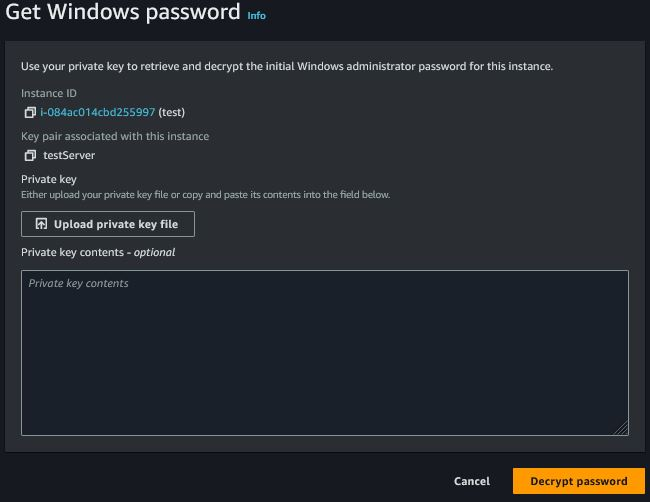

# AWS_Cloud_Sandbox_Project
## Section One
Launching an AWS Instance. 
Make sure you are aware of what region you are in, select the region that is closest to you.  
In the below instrunction you will “Launch an AWS instance”.

1. In Name and tags field: Name Instance.
   


3. In Applications and OS Images (Amazon Machine Images): Select Microsoft Windows Server 2022 base.
   


5. In Instance type: Select t2.medium.
   


7. In Key pair(login): Click "Create key pair", name key pair and keep default settings.
   


9. In Network settings: Use default settings and make sure RDP is selected.
    


11. In Configure Storage: Change GiB to "60"
    


13. Click "Launch Instance" to launch instance.
    


## Section Two
Connect to instance via RDP.

1. After launching instance, click “View all Instances” at the bottom of the page.
   


3. Click the box for the new instance you want to connect to and click "Connect".
   


4. Click the RDP client tab. If you are using Windows, download remote desktop file and move on to step 5. For macOS users decrypt password per step 5, check out step 6 for more instructions.

Username:
```
Administrator
```


5. Click "Get password" this password will be used to RDP into instance. Click "Upload private key file", this is
was created you created a rsa key pair. Once uploaded click "decrypt password". Copy decyrpted password. Paste
password in document and save file.



6. In the download folder, double click remote descktop file to open a RDP executible file. When prompted paste Administrator
password to authenticate the RDP sesssion. For macOS users, download macOS client.

[Check out this link for instruction to user and download Microsoft Remote Desktop] (https://learn.microsoft.com/en-us/windows-server/remote/remote-desktop-services/clients/remote-desktop-mac)

## Section Three
Configure the Windows Server with FlareVM.
After FlareVM and dependencies/packages are installed, an AMI will be created following the installation.
Install both Chrome and Firefox browsers. If there is any particular malware analysis tools you are requiring
for your sandbox environment, now would be a good time to install. If you setup and run INeTSim you will be isolated from
the internet.

1. While in the the newly create instance, open a browser of your choice and download the raw file. This is the
Mandiant flare-VM script that will be the bases of you sandbox enviornment.

[Go to URL:] (https://github.com/mandiant/flare-vm/blob/main/install.ps1)


2. Open powershell and move to the Downloads directory.

Run Commands:
```
Unblock-File ./
Unblock-File ./install.ps1
Set-ExecutionPolicy Unrestricted
```
At the prompt type "Y" and hit enter. Now minimize powershell.

3. Disable Microsoft Defender:
Navigate to Proxy settings: Type "proxy" in search windows search bar and open Change proxy settings. Turn off "Automatically detect settings".


Navigate to Local Group Policy Editor:  Type "group" in windows search bar and open "Edit group policy"
Once in the Local Group Policy Editor, navigate to Window Defender Antivirus.
Computer Configuration>Administrative Templates>Windows Components>Microsoft Defender Antivirus
Open "Turn off Microsoft Defender Antivirus" and click enable, then apply and save.


Now navigate to Domain Profile.
Computer Configuration>Administrative Templates>Network>Network Connections>Windows Defender Firewall>Domain Profile
Open Window Defender Firewall: Protect all network connections: click disable, then apply and save.


Now navigate to Standard Profile.
Computer Configuration>Administrative Templates>Network>Network Connections>Windows Defender Firewall>Standard Profile
Open Window Defender Firewall: Protect all network connections: click disable, then apply and save.


4. Now click powershell on the bottom bar, which you minimized in step 2.

Run Command:
```
./install.ps1
```

There will be multiple checks enter Yes "Y" and hit enter. When you get to Administrator password, enter the 
the decrypted password user used to first sign into the server. A dialog box will open after the script runs,
with default packages selected. You can add or remove packages here, in most case default is probably fine. When done
click "OK" to begin installation. The system will reboot multiple times, relogin after disconnection.

5. After flarevm installation, open failed packages folder, and verify all the important packages were successfully installed.

 ## Section Four
Creating a AMI

1. Return to the AWS console and stop the instance.
While instance is stil selected, click Actions drop down then select Images and templates, and click "Create image".


2. Name the image, keep default setting and click "Create image"


## Section Five
Create user.

1. Duplicate tab and navigate to AWS IAM.


2. Go to Users and click "Create users".
Name it and click "Next"


3. Click "Create group" to create user group.
Name user group, "XXX-Full-Access" and search "ec2f" in the search bar under permissions policies. Check mark the box,
then click "Create user group".


4. Next check mark the Group name in User groups, and click "Next"


6. Now click "Create user" to finalize.


## Section Six
Create access key.
Stay in IAM>Users

1. Click the new user name.


2. Click "Security credentials" tab and scroll down to Access keys field.


3. Click "Create access key".


4. Select "Command Line Interface (CLI) and select confirmation check box at the bottom, then click "Next"


5. Enter destription from Description tag value.
Name is "XXX-Access-Key" and click "Create access key"


6. Retrive access key and secret key, copy them and paste in a document and click "Done".
This will be the only time you will be able to copy both keys.


## Section Seven
Setting remote acces to AWS.
Multiple packages will need to be installed, "jq, AWS-CLI, and Terraform" on to your local machine.
Homebrew may need to be installed on macOS, if homebrew package manager is not already installed. If you are using windows
WSL Ubuntu 22.4.x version go to sub section Seven.

Run Command:
```
/bin/bash -c "$(curl -fsSL https://raw.githubusercontent.com/Homebrew/install/HEAD/install.sh)"
```

1. Install jq, awscli, and Terraform.

Run Commands:
```
brew install jq
brew install awscli
brew tap hashicorp/tap
brew install hashicorp/tap/terraform
brew update
brew upgrade hashicorp/tap/terraform
```
Test awscli by running “awscli” on the command line.
Test terraform by running “terraform -help” on the command line.

### Sub Section Seven

Run Commands:
```
sudo apt install jq
sudo apt install awscli
wget -O- https://apt.releases.hashicorp.com/gpg | sudo gpg --dearmor -o /usr/share/keyrings/hashicorp-archive-keyring.gpg
echo "deb [signed-by=/usr/share/keyrings/hashicorp-archive-keyring.gpg] https://apt.releases.hashicorp.com $(lsb_release -cs) main" | sudo tee /etc/apt/sources.list.d/hashicorp.list
sudo apt update && sudo apt install terraform
```
Test awscli by running “awscli” on the command line.
Test terraform by running “terraform -help” on the command line.

## Section Eight
Setup working directory.

1. Make a working directory.

Run Command:
```
mkdir sandbox-cloud-lab
```
2. Change to new directory.

Run Command:
```
cd sandbox-cloud-lab
```


3. Run AWS-CLI to setup remote access.

Run Command:
```
aws configure
```
At the prompt	enter AWS Access key and hit enter. 
At the prompt enter Secret Key and hit enter. 
Next enter the region the AWS instance and hit enter 
Then type “json” and hit enter.


## Section Nine
Pull AWS_Cloud_Project clone.

1. Clone a AWS Cloud Project from GitHub.

Run command:
```
git clone https://github.com/droliva10/AWS_Cloud_Project
```

## Section Ten
Edit files in the AWS_Cloud_Project directory.

1. Move into the AWS_Cloud_Project directory.

Run Command:
```
cd AWS_Cloud_Project
```

2. Make a file and name it “shared.auto.tfvars.json”.

Run Command:
```
touch share.auto.tfvars.jason
```
3. Add the below block. The "ami" is ami of the flare-vm which was created in Section Four. The "account" is the AWS account.
The "region" is the region the flare-VM was created in. For a simple a sandbox with only internet access, leave "enable_guacamole"
and "enable_inetsim" false. If you want to isolate instance during malware detonations, make INeTSim true.

```
{
   "environment": "sandbox-lab",
   "ami": "ami-xxxxxxxxxxxxxxxxx",
   "account": "11111111111111",
   "region": "us-west-1",
   "enable_guacamole": false,
   "enable_inetsim": false
}
```


   
## Section Eleven
Edit AWS_Cloud_Project files.

1. Go to AWS console and navigate to the AMI catalog. In the search bar search for "ubuntu". Copy the ami string.


2. Return to your local machine command line.

Run Command:
```
terraform –version
```

This will outout the terraform version.


3. Open main.tf with a text editor. On the second line, edit terraform verion with the version output. Save exit editor.


4. Open instance.tf with a editor.
Scroll down to “Linux instance with INeTSim” Edit the ami with the ami string you copied from step 1 of this section.


## Section Twelve
Build the AWS infrastructure.
You should not get any errors in any of the below steps, troubleshoot if you get errors.

1. Initialize terraform.

Run Command:
```
terraform init
```
2. Create the execution plan.

Run Command:
```
terraform plan
```

3. Executes the actions.

Run Command:
```
terraform apply
```

4. At the prompt type “yes”.
The AWS infrastructure will begin building. At the completion of the build copy the output IP.


## Section Thirteen
Connect to malware lab/sandbox environment.

1. Open RDP client enter copied IP. For macOS users open Microsoft Remote Desktop and add a new PC.
Username = Administrator 
Password = User password you decrypted in section two.

## Section Fourteen
To run in an isolated environment, no internet access. Test INETSim server, if set to true in Section Ten step 3.

1. Open powershell

Run Command:
```
Get-NetAdapter -Name "Ethernet 2" | Set-DnsClientServerAddress -ServerAddresses 	"172.16.10.6"
```
2. Test internet.
Open a browser and do a google search you should see a INeTSim warning. Traffic is now routed through fake DNS server. If INetSim is not configured internet access will not be blocked.

## Section Fifteen
To shut down sandbox environment and delete AWS Infrastructure.

1. To destroy environment.

Run Command:
```
terraform destroy
```

2. Enter “yes’ when prompted.


## COST
AWS On-demand Windows base: 0.0732 USD per Hour.

AWS On-demand Linux base: 0.0276 USD per Hour, if running malware sandbox.
